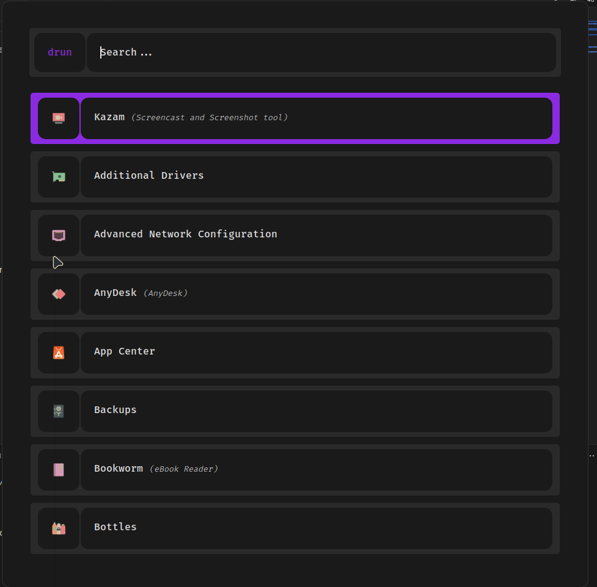
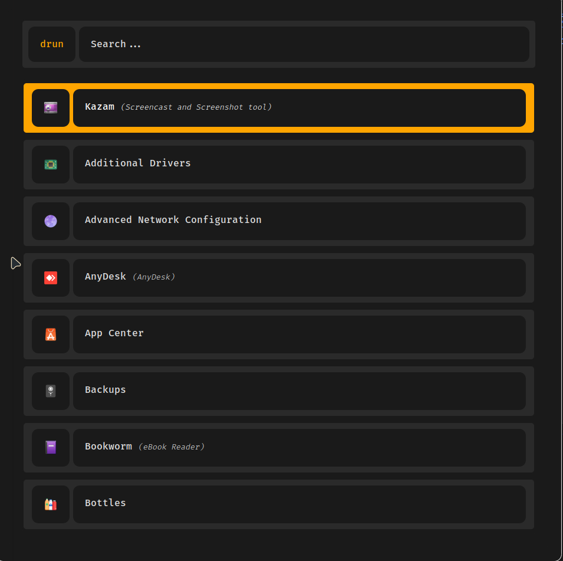

# Dark Rofi Themes

This repository contains a collection of dark themes for Rofi.

## Available Themes

### Modern Dark (`modern-daark.rasi`)



### Sunny Orange (`sunny-orange.rasi`)



## Installation

1.  Make sure you have Rofi installed.
2.  Clone this repository or download the files.
3.  Make the installation script executable:
    ```bash
    chmod +x install.sh
    ```
4.  Run the installation script:
    ```bash
    ./install.sh
    ```
    This script will copy the theme files to your Rofi configuration directory (`~/.config/rofi/themes/`) and apply selected theme by default.

## Usage

Refer to the Rofi documentation for more details on applying themes.
